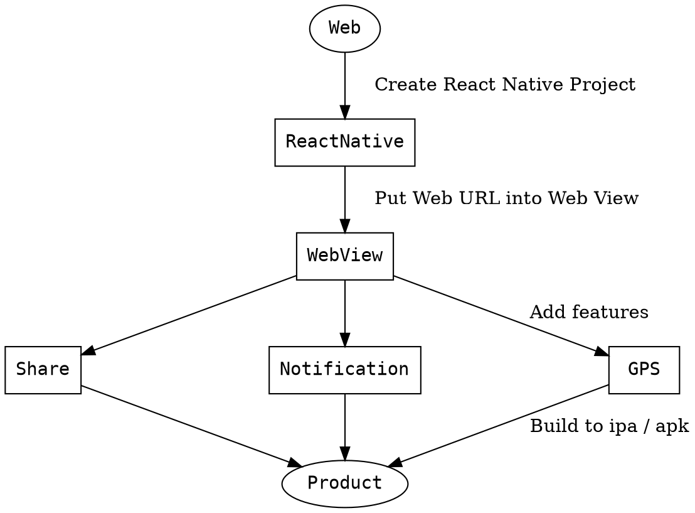

# Bonny Live(Phase 2) React Native

## Start Project

### clone project

```javascript=
git clone https://github.com/bonnyliveservice/react-native.git

cd react-native

expo start
```

[Expo](https://expo.io/learn)


### show app in iOS / Android simulator

1. iOS

install XCode

[XCode](https://developer.apple.com/xcode/)

3. Android

install Android Studio

[Android Studio](https://developer.android.com/studio/install)

## Project flow



## Precautions

Create iOS App must attention to the use behavior, iOS App doesn't have back button, An additional return button must be set in iOS.

Android App must modify the back button to guide web view.

User account must keep login.


## Reference

1. [Share](https://facebook.github.io/react-native/docs/share)
2. [Geolocation](https://facebook.github.io/react-native/docs/geolocation)
3. [Notification](https://facebook.github.io/react-native/docs/pushnotificationios)

